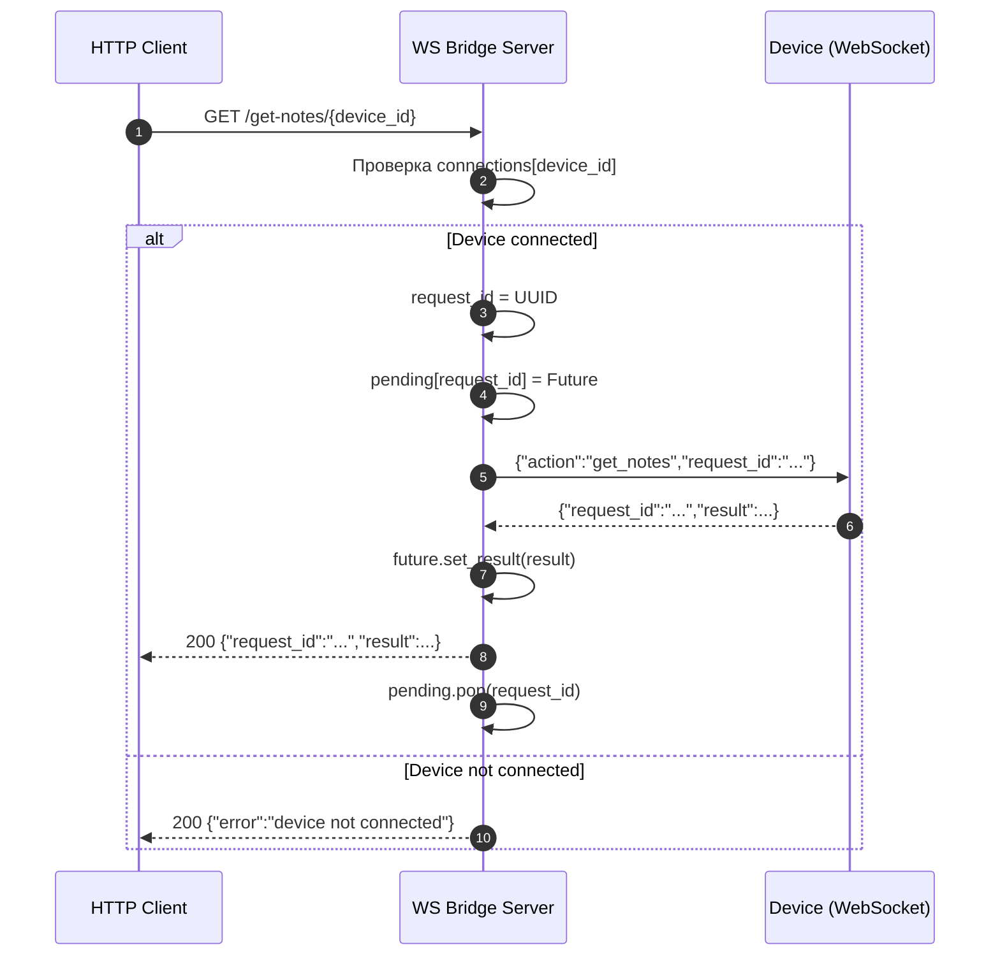
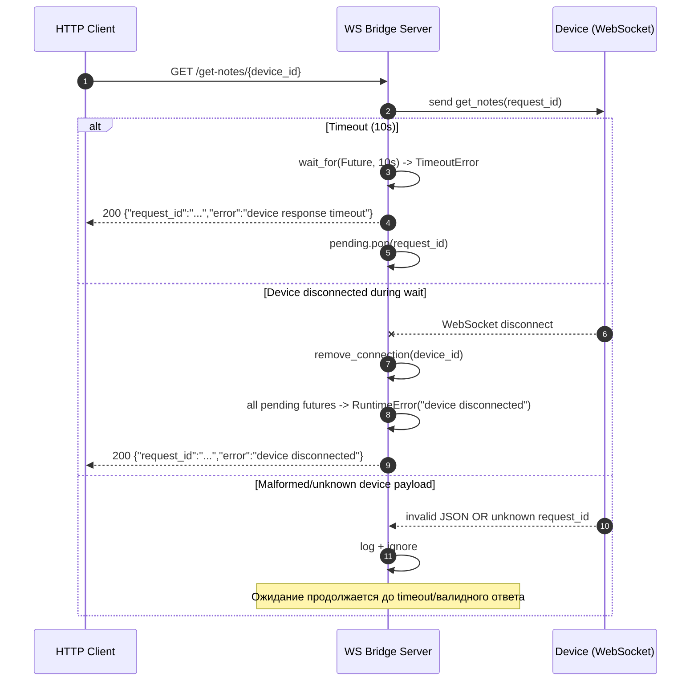

# WS Bridge Server Sequence

## Основной сценарий: успешный запрос `GET /get-notes/{device_id}`

## Альтернативы и ошибки

## Примечания для команды
- Корреляция запрос-ответ выполняется строго по `request_id`.
- `GET /get-events/{device_id}` временно сохранен как legacy alias.
- Для потокобезопасности используются два lock:
  - `connections_lock` для глобального реестра устройств.
  - `pending_lock` для in-flight запросов конкретного устройства.
- Очистка `pending` в `finally` обязательна для предотвращения утечек ожиданий.
- Одинаковый `device_id` допускает только одну активную WS-сессию: старая закрывается при новом подключении.
